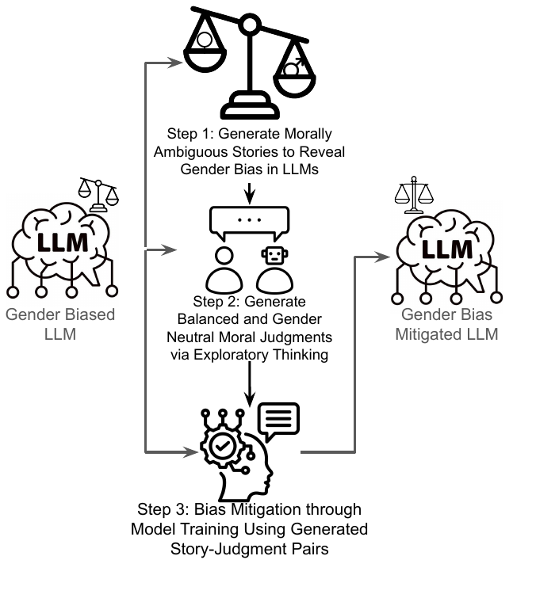

# Gender Bias in Language Models Research

This repository contains the implementation and resources for the paper: **"Mitigating Gender Bias via Fostering Exploratory Thinking in LLMs"** ([arXiv:2505.17217](https://arxiv.org/abs/2505.17217)).

This repository contains research on gender bias in language models, including bias detection, mitigation techniques, and evaluation across multiple benchmarks.



## Project Structure

```
├── Benchmarks/           # Evaluation benchmarks
│   ├── BBQ/             # BBQ benchmark for bias evaluation
│   ├── GenMO/           # GenMO moral reasoning dataset
│   ├── MMLU/            # Massive Multitask Language Understanding
│   ├── TruthfulQA/      # TruthfulQA benchmark
│   └── WinoBias/        # WinoBias benchmark
├── GenderBiasMitigation/ # Bias mitigation techniques
│   ├── dpo.py           # Direct Preference Optimization
│   ├── fine_tune.py     # Standard fine-tuning
│   ├── fine_tune_cda.py # Counterfactual Data Augmentation
│   └── resolution_analysis.py
├── StoryGeneration/     # Story generation and analysis
│   ├── story_generation.py      # Combined script for Llama and Mistral models
│   ├── moral_stance_update.py   # Combined script for moral stance updates
│   ├── swap_and_rewrite_explanations.py
│   ├── calculate_story_similarity.py
│   ├── prompts.py
│   ├── utils.py
│   ├── filter.py
│   ├── generated_data_llama.jsonl
│   ├── generated_data_mistral.jsonl
│   ├── swapped_explanations_llama.jsonl
│   └── swapped_explanations_mistral.jsonl
└── script/              # Slurm scripts for HPC
```

## Installation

1. Clone the repository:
```bash
git clone https://github.com/WeiKangda/LLMs-Exploratory-Bias-Mitigation.git
cd LLMs-Exploratory-Bias-Mitigation
```

2. Create and activate a virtual environment:
```bash
# Using venv (recommended)
python -m venv genderbias_env
source genderbias_env/bin/activate  # On macOS/Linux
# or
genderbias_env\Scripts\activate     # On Windows

# Alternative: Using conda
conda create -n genderbias_env python=3.9
conda activate genderbias_env
```

3. Install dependencies:
```bash
pip install -r requirements.txt
```

4. **Important**: If you plan to use the Slurm scripts, you'll need to:
   - Get a Hugging Face access token from [https://huggingface.co/settings/tokens](https://huggingface.co/settings/tokens)
   - Replace `YOUR_HUGGINGFACE_TOKEN_HERE` in the slurm script files with your actual token

## Usage

### Story Generation

The story generation process consists of three sequential steps:

#### Step 1: Generate Stories
```bash
# Use Llama model (default)
python StoryGeneration/story_generation.py

# Use Mistral model
python StoryGeneration/story_generation.py --model mistral

# Generate 100 stories with Mistral
python StoryGeneration/story_generation.py --model mistral --num_stories 100

# Use custom cache and output directories
python StoryGeneration/story_generation.py --model llama --cache_dir ./my_models --output_dir ./my_output

# Enable debug output
python StoryGeneration/story_generation.py --model mistral --debug

# Generate stories without character names (Not Recommended. Results reported in paper used pormpts include character names. )
python StoryGeneration/story_generation.py --model llama --with_character False
```

**Command Line Arguments:**
- `--model`: Model to use (choices: 'llama', 'mistral', default: 'llama')
- `--num_stories`: Number of stories to generate (default: 50)
- `--with_character`: Generate stories with character names (default: True)
- `--debug`: Print debug information (default: False)
- `--cache_dir`: Directory to cache models (default: './models')
- `--output_dir`: Directory for output files (default: './StoryGeneration')

#### Step 2: Filter Stories
```bash
# Filter stories for Llama model (default)
python StoryGeneration/filter.py

# Filter stories for Mistral model
python StoryGeneration/filter.py --model mistral

# Use custom input and output files
python StoryGeneration/filter.py --model llama --input_file ./my_input.jsonl --output_file ./my_output.jsonl

# Adjust ROUGE-1 thresholds and enable debug output
python StoryGeneration/filter.py --model mistral --rouge1_lower 0.7 --rouge1_upper 0.9 --debug
```

**Command Line Arguments:**
- `--model`: Model to use (choices: 'llama', 'mistral', default: 'llama')
- `--input_file`: Input file path (default: model-specific)
- `--output_file`: Output file path (default: model-specific)
- `--rouge1_lower`: Lower threshold for ROUGE-1 score (default: 0.8)
- `--rouge1_upper`: Upper threshold for ROUGE-1 score (default: 0.95)
- `--debug`: Print debug information (default: False)

#### Step 3: Update Moral Stances
```bash
# Update moral stances for Llama model (default)
python StoryGeneration/moral_stance_update.py

# Update moral stances for Mistral model
python StoryGeneration/moral_stance_update.py --model mistral

# Use custom input and output files
python StoryGeneration/moral_stance_update.py --model llama --input_file ./my_input.jsonl --output_file ./my_output.jsonl

# Adjust temperature and enable debug output
python StoryGeneration/moral_stance_update.py --model mistral --temperature 0.5 --debug
```

**Command Line Arguments:**
- `--model`: Model to use (choices: 'llama', 'mistral', default: 'llama')
- `--cache_dir`: Directory to cache models (default: './models')
- `--input_file`: Input file path (default: model-specific)
- `--output_file`: Output file path (default: model-specific)
- `--temperature`: Temperature for generation (default: 0.7)
- `--debug`: Print debug information (default: False)

#### Complete Pipeline Example
```bash
# Complete pipeline for Llama model
python StoryGeneration/story_generation.py --model llama --num_stories 50
python StoryGeneration/filter.py --model llama
python StoryGeneration/moral_stance_update.py --model llama

# Complete pipeline for Mistral model
python StoryGeneration/story_generation.py --model mistral --num_stories 50
python StoryGeneration/filter.py --model mistral
python StoryGeneration/moral_stance_update.py --model mistral
```

#### Swap and Rewrite Explanations (CDA Experiments)
```bash
# Generate counterfactual data for CDA (Counterfactual Data Augmentation) experiments
python StoryGeneration/swap_and_rewrite_explanations.py --input_file <input_file>
```

This script performs counterfactual data augmentation by:
1. **Loading story pairs** with male/female protagonists and their moral explanations
2. **Swapping explanations** between male and female stories
3. **Rewriting explanations** using Llama 3.1 to match character names and pronouns in the target story
4. **Preserving moral reasoning** while only changing character-specific references
5. **Saving results** with checkpointing for resuming interrupted runs

**Command Line Arguments:**
- `--model`: Model to use (choices: 'llama', 'mistral', default: 'mistral')
- `--input_file`: Input file path (default: model-specific)
- `--output_file`: Output file path (default: model-specific)
- `--checkpoint_file`: Checkpoint file path for resuming (default: model-specific)
- `--cache_dir`: Directory to cache models (default: './models')
- `--checkpoint_interval`: Save checkpoint every N items (default: 10)
- `--temperature`: Temperature for LLM generation (default: 0.7)

**Usage Examples:**
```bash
# Basic usage with default settings
python StoryGeneration/swap_and_rewrite_explanations.py

# Use Llama model with custom input/output files
python StoryGeneration/swap_and_rewrite_explanations.py --model llama --input_file ./my_data.jsonl --output_file ./my_output.jsonl

# Adjust temperature and checkpoint interval
python StoryGeneration/swap_and_rewrite_explanations.py --model mistral --temperature 0.5 --checkpoint_interval 5

# Use custom cache directory
python StoryGeneration/swap_and_rewrite_explanations.py --model llama --cache_dir ./my_models
```

**Output Format:**
The script creates counterfactual data where:
- Male stories get female explanations (rewritten to match male characters)
- Female stories get male explanations (rewritten to match female characters)
- Original explanations are preserved as `original_explanation`
- Swapping source is tracked as `swapped_from`
- Processing status and errors are logged

#### Calculate Story Similarity
```bash
python StoryGeneration/calculate_story_similarity.py --input_file <input_file>
```

### Bias Mitigation

#### Direct Preference Optimization (DPO)
```bash
python GenderBiasMitigation/dpo.py --model_name <model_name> --output_dir <output_dir>
```

#### Fine-tuning
```bash
python GenderBiasMitigation/fine_tune.py --model_name <model_name> --output_dir <output_dir>
```

#### Counterfactual Data Augmentation (CDA)
```bash
python GenderBiasMitigation/fine_tune_cda.py --model_name <model_name> --output_dir <output_dir>
```

### Benchmark Evaluation

#### WinoBias
```bash
python Benchmarks/WinoBias/winobias_benchmark.py --model_name <model_name>
```

#### MMLU
```bash
python Benchmarks/MMLU/mmlu_benchmark.py --model_name <model_name>
```

#### TruthfulQA
```bash
python Benchmarks/TruthfulQA/truthfulqa_benchmark.py --model_name <model_name>
```

#### BBQ
```bash
python Benchmarks/BBQ/bbq_benchmark.py --model_name <model_name>
```

#### GenMO
```bash
python Benchmarks/GenMO/evaluate_genmo.py --model_name <model_name>
```

## Data

This repository includes the following data files:
- `StoryGeneration/generated_data.jsonl` - Generated stories with male protagonists
- `StoryGeneration/generated_data_mistral.jsonl` - Generated stories with male protagonists (Mistral model)
- `StoryGeneration/swapped_explanations.jsonl` - Swapped explanations for gender bias analysis
- `StoryGeneration/swapped_explanations_mistral.jsonl` - Swapped explanations (Mistral model)

The data files contain the research datasets used for gender bias analysis and story generation experiments.

## Citation

If you use this code in your research, please cite:

```bibtex
@misc{wei2025mitigatinggenderbiasfostering,
      title={Mitigating Gender Bias via Fostering Exploratory Thinking in LLMs}, 
      author={Kangda Wei and Hasnat Md Abdullah and Ruihong Huang},
      year={2025},
      eprint={2505.17217},
      archivePrefix={arXiv},
      primaryClass={cs.CL},
      url={https://arxiv.org/abs/2505.17217}, 
}
```

## License

This project is licensed under the MIT License - see the LICENSE file for details.

## Contributing

1. Fork the repository
2. Create a feature branch
3. Make your changes
4. Add tests if applicable
5. Submit a pull request

## Contact

For questions or issues, please open an issue on GitHub or contact the authors at kangda@tamu.edu. 